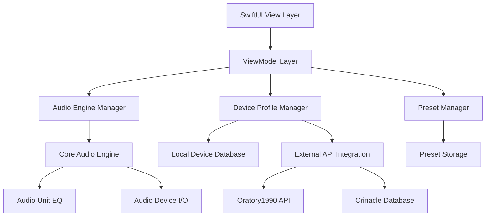
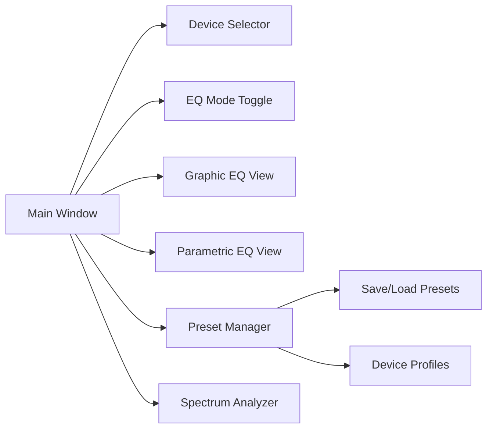

# AudioEQ App - Technical Architecture Plan

## Overview
AudioEQ is a native macOS application that provides advanced audio equalization capabilities with both graphic and parametric EQ modes, device-specific presets, and integration with headphone measurement databases.

## Technology Stack
- **Language**: Swift 5.7+
- **UI Framework**: SwiftUI
- **Audio Framework**: Core Audio (Audio Unit, Audio Queue)
- **Data Persistence**: Core Data + UserDefaults
- **Architecture Pattern**: MVVM (Model-View-ViewModel)

## System Architecture



## Core Components

### 1. Audio Engine Manager
- **Responsibilities**: Audio device management, real-time audio processing
- **Key APIs**: AudioUnit, AudioDeviceID, AudioObjectPropertyAddress
- **Features**:
  - Device detection and selection
  - Real-time audio routing
  - Low-latency processing

### 2. EQ Processing Engine
- **Graphic EQ**: 10-band fixed frequency (31, 63, 125, 250, 500, 1k, 2k, 4k, 8k, 16k Hz)
- **Parametric EQ**: Up to 8 configurable bands with:
  - Frequency: 20Hz - 20kHz
  - Q factor: 0.1 - 10
  - Gain: -20dB to +20dB
  - Filter types: Bell, Low Shelf, High Shelf, Low Pass, High Pass

### 3. Device Profile System
- **Local Storage**: Core Data model for device profiles
- **External Integration**: 
  - Oratory1990 measurement data parsing
  - Crinacle database integration
  - Custom measurement import

### 4. User Interface Architecture



## Data Models

### Device Profile
```swift
struct DeviceProfile {
    let id: UUID
    let name: String
    let manufacturer: String
    let model: String
    let type: DeviceType // .headphone, .speaker, .inEar
    let frequencyResponse: [FrequencyPoint]
    let recommendedEQ: EQSettings
    let dataSource: DataSource // .local, .oratory1990, .crinacle
}
```

### EQ Settings
```swift
struct EQSettings {
    let id: UUID
    let name: String
    let graphicBands: [GraphicBand]
    let parametricBands: [ParametricBand]
    let mode: EQMode // .graphic, .parametric, .combined
}
```

## Implementation Phases

### Phase 1: Foundation (Weeks 1-2)
- Xcode project setup
- Basic SwiftUI interface
- Core Audio integration
- Device detection

### Phase 2: Core EQ (Weeks 3-4)
- Graphic EQ implementation
- Parametric EQ implementation
- Real-time audio processing
- Basic preset system

### Phase 3: Device Integration (Weeks 5-6)
- Device profile database
- External API integration
- Measurement data parsing
- Profile management UI

### Phase 4: Advanced Features (Weeks 7-8)
- Spectrum analyzer
- Advanced preset management
- User preferences
- Performance optimization

## Technical Challenges & Solutions

### 1. Audio Latency
- **Challenge**: Minimizing latency for real-time EQ
- **Solution**: Use Audio Unit's built-in EQ with optimized buffer sizes

### 2. Device Permission
- **Challenge**: macOS requires permissions for audio device access
- **Solution**: Implement proper permission handling and user guidance

### 3. Real-time Visualization
- **Challenge**: Smooth spectrum analyzer without affecting audio quality
- **Solution**: Separate processing thread for visualization

### 4. Data Synchronization
- **Challenge**: Keeping EQ settings synchronized across different views
- **Solution**: Combine pattern with ObservableObject and @StateObject

## Testing Strategy
- Unit tests for audio processing algorithms
- Integration tests for device detection
- UI tests for user interactions
- Performance testing for latency measurements

## Distribution
- Mac App Store distribution
- Sandbox compliance
- Code signing and notarization
- Minimum macOS version: 12.0 (Monterey)